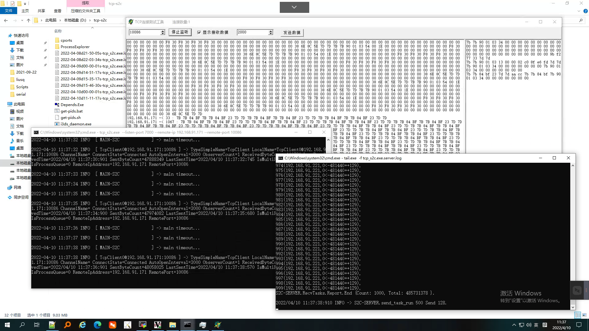

## 高并发多连接，数据分析转发工具 tcp_s2c
### 经过几天的BUG修复，程序优化，自测600个连接各自每秒发一条数据包（随机插入错乱数据）一天多，具备发布预测版能力


### windows 安装
```text
把 tcp_s2c.zip 解压到 D:\tcp-s2c目录中
## 其实解压到哪都可以的

# 去到程序所在的根目录
# e.g.
cd /d d:\tcp-s2c

```


### 主程序：tcp_s2c , 监听一个TCPServer端口，把多个连接发过来的报文，按头“{{”尾“}}”分别在各自连接中提取出完整帧后，统一按队列式通过自身的TCPClient发给远程目标的 TCPServer
```shell
# 程序：tcp_s2c

# windows
tcp_s2c.exe --listen-port 7000 --remote-ip 192.168.91.171 --remote-port 10086

# linux
./tcp_s2c --listen-port 7000 --remote-ip 192.168.91.171 --remote-port 10086

# --listen-port       TCPServer 监听的端口
# --remote-ip         TCPClient 远程连接的IP地址
# --remote-port       TCPClient 远程连接的端口

```


### 模仿 客户端设备来连接到 tcp_s2c 
### 测试程序：tcpclient100 , 可以发起多个TCP Client连接目标端的测试工具
```shell
# 程序：tcpclient100
# 测试报文文件：plc.txt

# 运行：
# windows
tcpclient100.exe --remote-ip 192.168.91.221 --remote-port 7000 --client-count 100 --send-interval 1000

# linux
./tcpclient100.exe --remote-ip 192.168.91.221 --remote-port 7000 --client-count 100 --send-interval 1000

# --remote-ip         TCPClient 远程连接的IP地址
# --remote-port       TCPClient 远程连接的端口
# --client-count      可以发起的连接数
# --send-interval     连接成功后，以周期性发送数据，单位毫秒

```


### 模仿 电表数据采集器，也就是 tcp_s2c 远程目标的 TCPServer
```shell
# 程序：TcpServer.exe

```


### 运行后效果图
> ：
